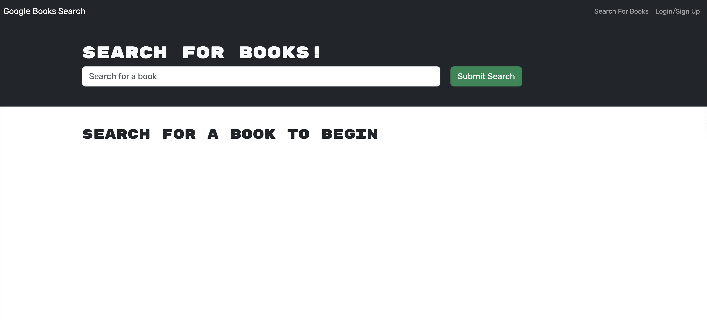
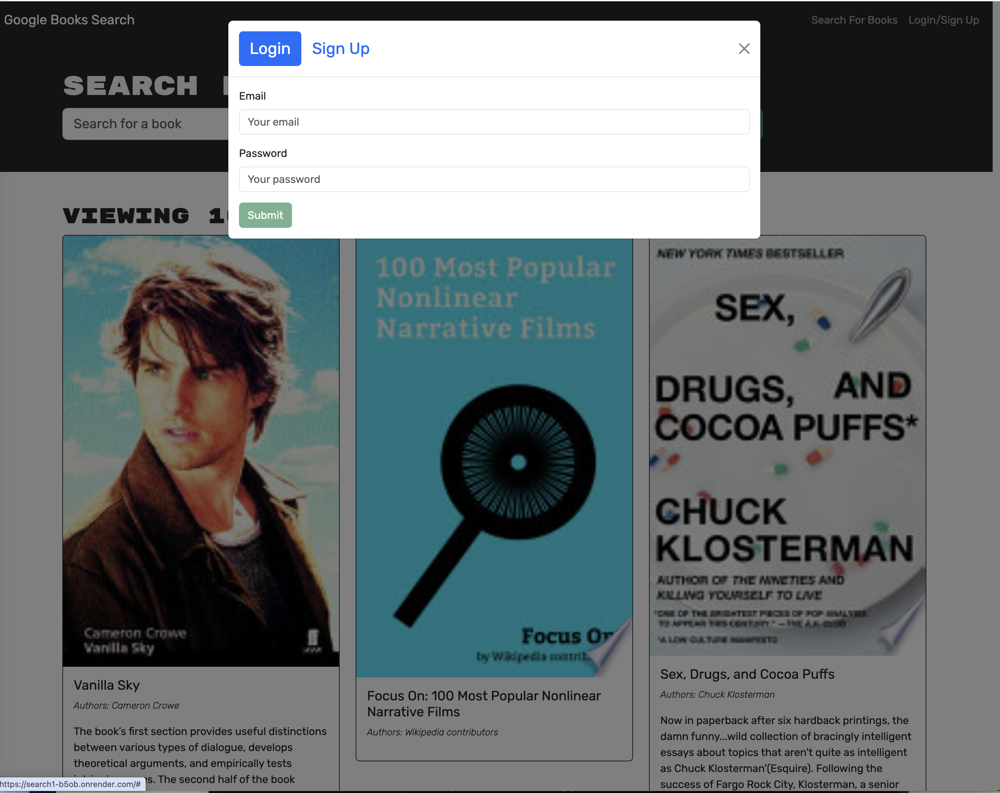
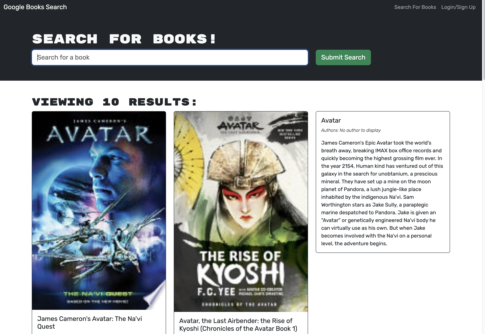

# # Virtual Book Find

## Links

- Link 🟢 Deployed URL 🔹 [Virtual Book Find}( 🔹

- Link 🔴 GitHub Repository [https://github.com/MTS-sip/search1 🔴

## Description

Google Book Search App: Book results fetched from the Google Books API, including book title, author, and action buttons (e.g saving), with Login/Signup authentication.

### Table of Contents

- Usage
- Images
- License
- Technology
- Contributing
- User Story &
- Acceptance Criteria

### Usage & Testing

For usage.

- Clone Repository [Clone Repository](https://github.com/MTS-sip/search1)
- npm install 
- Create .env for connection to a MongoDB 
  MONGO_URI=(the DB you are connecting to) 
  JWT_SECRET=(create secret key) 
- Run dev script in package.json 

- [Virtual Book Find](https://github.com/MTS-sip/search1))

### App Screenshots

### 📚 Google Books Results

Displays a list of book results fetched from the Google Books API, including book title, author, and action buttons for saving.

---

- 🔐 Login Page

User authentication page with fields for entering email and password.

---

### 🔎 Book Search Interface

Interface allowing users to search for books by keyword and display real-time results from the API.

### License

This project is licensed under the MIT 

### Technology

Key technologies used for development:

🔹 **VS Code**: [VSC IDE](https://code.visualstudio.com/) 
🔹 **Render**: [Cloud Application Platform Render](https://render.com/) 
🔹 **GitHub**: [Github](https://github.com/) 
🔹 **Vite**: [ Front end Build Tool for the Web](https://vite.dev/) 
🔹 **Typescript**: [JavaScript w/syntax for types ](https://www.w3schools.com/typescript/typescript_intro.php) 
🔹 **npm**: [Package manager for js](https://www.npmjs.com/) 
🔹 **CoPilot**: [Copilot for GitHub](https://github.com/features/copilot?ef_id=_k_Cj0KCQjw4v6-BhDuARIsALprm30F26jOBa_tX-MdbRzSHmPNFiQCmfhZXt1XYobPc8mf7E3NM44SAmQaAipREALw_wcB_k_&OCID=AIDcmmb150vbv1_SEM__k_Cj0KCQjw4v6-BhDuARIsALprm30F26jOBa_tX-MdbRzSHmPNFiQCmfhZXt1XYobPc8mf7E3NM44SAmQaAipREALw_wcB_k_&gad_source=1&gclid=Cj0KCQjw4v6-BhDuARIsALprm30F26jOBa_tX-MdbRzSHmPNFiQCmfhZXt1XYobPc8mf7E3NM44SAmQaAipREALw_wcB) 
**MonGoDB**:[MONGODB ATLAS](https://www.mongodb.com/)
**ApolloServer**: [apollographql](https://www.apollographql.com/docs/apollo-server)

### Contributing

MTS-Sip [aka MPossible](https://github.com/MTS-sip) 
Dev/Starter Code, RU BCS

### User Story

🔹 AS AN employer avid reader

- I WANT to search for new books to read
- SO THAT I can keep a list of books to purchase

### Acceptance Criteria

🔹 GIVEN a a book search engine

- WHEN I load the search engine  
  THEN I am presented with a menu with the options Search for Books and Login/Signup and an input field to search for books and a submit button
- WHEN I click on the Search for Books menu option  
  THEN I am presented with an input field to search for books and a submit button
- WHEN I am not logged in and enter a search term in the input field and click the submit button 
  THEN I am presented with several search results, each featuring a book’s title, author, description, image, and a link to that book on the Google Books site
- WHEN the toggle is set to Signup  
  THEN I am presented with three inputs for a username, an email address, and a password, and a signup button
- WHEN the toggle is set to Login  
  THEN I am presented with two inputs for an email address and a password and login button
- WHEN the I enter a valid email address and create a password and click on the signup button  
  THEN my user account is created and I am logged in to the site
- WHEN I enter my account’s email address and password and click on the login button 
  THEN the modal closes and I am logged in to the site
- WHEN I am logged in to the site 
  THEN the menu options change to Search for Books, an option to see my saved books, and Logout
- WHEN I am logged in and enter a search term in the input field and click the submit button 
  THEN I am presented with several search results, each featuring a book’s title, author, description, image, and a link to that book on the Google Books site and a button to save a book to my account
- WHEN I click on the Save button on a book 
  THEN that book’s information is saved to my account
- WHEN I click on the option to see my saved books 
  THEN I am presented with all of the books I have saved to my account, each featuring the book’s title, author, description, image, and a link to that book on the Google Books site and a button to remove a book from my account
- WHEN I I click on the Remove button on a book 
  THEN that book is deleted from my saved books list
- WHEN I I click on the Logout button 
